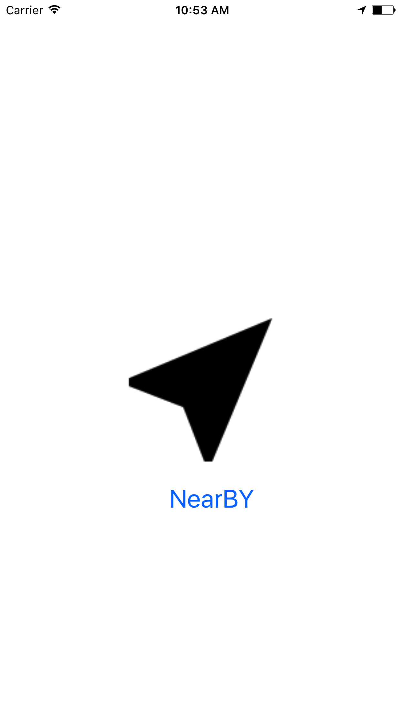
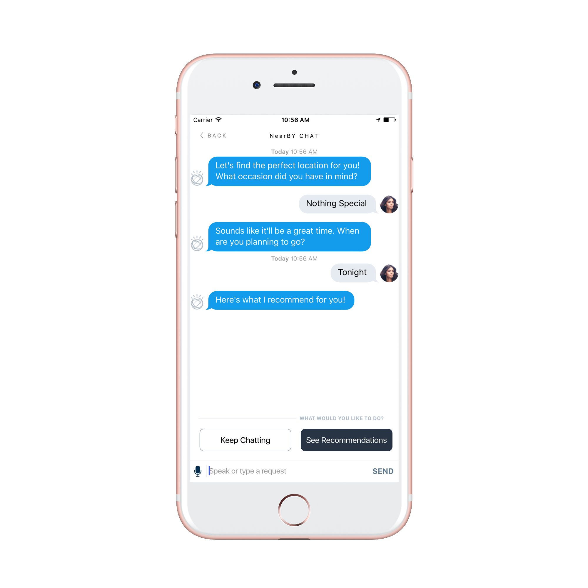

# NearBY - An iOS travel Advisor app Powered by IBM Bluemix (Mobile Services, Watson, Kitura)

NearBY is inspired from [CognitiveConcierge](https://github.com/IBM-MIL/CognitiveConcierge).
CognitiveConcierge is an end-to-end Swift application sample with an iOS front end and a Kitura web framework back end.  


<p align="center">


</p>

## Enhancements 

- Auto detection of Location using CLLocationManager.
- Bluemix Mobile Analytics.
- Plug and play options (You can add any category like museums, movie-theater etc.,).
- Flexible Kitura calls. Easy to add Google Place types.
- Push Notification via OpenWhisk whenever there is a significant location change.

More to follow....


*Note*: Most of the UI and backend is adopted from CognitiveConcierge app.

The app has two parts 

1. NearBY-Server: Built using [Kitura](http://www.kitura.io), a lightweight HTTP Web framework written in Swift allowing you to write complex routes easily and quickly. You will be using Kitura to talk to Google Places API.


2. NearBY-iOS: An iOS app written in Swift and using Watson Cognitive Services like Conversation, Text-to-Speech, Speech-to-Text and enhanced with Bluemix Mobile Services like Push Notifications and Mobile Analytics

## NearBY-Server 
 

### Obtain a Google Places API Key for Web

For this project, you'll need an API Key from Google Places. Instructions for obtaining a key can be found [here](https://developers.google.com/places/web-service/get-api-key).

Once you have an API Key, go to the Google Developer's Console, and enable the Google Places API for iOS as well. Make note of the API key for later use in your server and iOS applications. Wait at least 10 minutes for the key to become active.

### Clone, Create & Deploy the Server Application to Bluemix using ICT.

1. Install [IBM Cloud Tools for Swift] (http://cloudtools.bluemix.net/) for MacOS.
2. Once you've installed the application, you can open it to get started.
3. Goto IBM Cloud Tools for Swift( App Menu) -> Advanced -> Create Sample Project from Github Repo and paste this link **https://github.com/VidyasagarMSC/NearBY** and click Next.
4. Give a unique name to your project. Also a unique name (without special characters) to your Cloud Runtime (Server-Side). Click Save Files to Local Computer to clone the project.
5. This deployment to Bluemix may take a few minutes. Your Kitura server and other Bluemix services required for your app is provisioned along with the deployment.

6. Once the project is cloned, open up the .xcodeproj file that was created for you in ICT under Local Server Repository. Edit the Sources/restaurant-recommendations/Configuration.swift file's Constants struct with your own Google API Key for Web.

	
	
7. Re-deploy your server changes via ICT or via Cloud Foundry CLI `cf push`


### Point iOS Application to Server Application
In ICT, ensure that the Connected to: field in the Client application is pointed to your server instance running on Bluemix.  You can also point to your localhost for local testing, but you need to be running a local instance of the server application for this to work.

### Run locally 

1. Open Terminal and point to NearBY-Server under the cloned folder. 
2. Run 
 ```
swift build
 ```
3. This pulls all the dependencies mentioned in package.swift file including kitura. 
4. Run
```
./.build/debug/restaurant-recommendations
```

open a browser and point to localhost:8090 to see Kitura running.

### Conversation Service Created and Updated by ICT
1. Once ICT has provisioned your Cloud Runtime, you should see that you have a Conversation Service instance in your Bluemix dashboard.  This Service enables you to add a natural language interface to your applications.  While you could create a conversation tree manually, ICT has run some set up scripts (found in the `Cloud-Scripts/conversation` folder) to add a populated workspace to your conversation service.  This workspace is populated using the json found in `Resources/conversationWorkspace.json`


## NearBY-iOS
### Run the iOS Application
1. Install Cocoapods Dependency Manager in Terminal with the command `sudo gem install cocoapods`

2. Install Carthage Dependency Manager.  Either download and run the .pkg file for their latest release https://github.com/Carthage/Carthage/releases or simply run `brew update` followed by `brew install carthage`
3. From Terminal, change directories into the YourProjectName/NearBY-iOS folder.
4. Run the following commands to install the necessary dependencies:

  ```
  carthage update --platform iOS
  ```
 
  ```
   pod install
  ```

5. Open the NearBY.xcworkspace file in Xcode 8+ either from ICT or from your terminal using `open NearBY.xcworkspace`

6. For your iOS application to run, it needs access to some credentials from Bluemix.  ICT has run some set up scripts to generate and populate the `NearBY-iOS/CognitiveConcierge/CognitiveConcierge.plist` file. You will need to open this file and add your Watson, Mobile service usernames and passwords. Also the Google API Key.
7. To point to localhost, open *Bluemix.plist* and set isLocal to YES.

8. Press the Play button in Xcode to build and run the project in the simulator or on your iPhone!

### Additional
1. You can configure Bluemix Mobile Analytics by creating the service on Bluemix and adding the key in CognitiveConcierge.plist.

